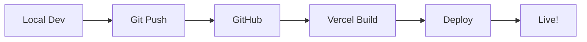

# 🏥 Doctor360 Healthcare Platform

Production-ready healthcare SaaS platform built with Next.js 16, TypeScript, and modern web technologies.

## 🎯 Overview

Doctor360 is a comprehensive healthcare management platform featuring:
- 👨‍⚕️ Doctor profiles and verification
- 📅 Appointment booking system
- 💊 Prescription management
- 📋 Electronic Medical Records (EMR)
- 💳 Payment processing
- 🤖 AI health assistant
- 📊 Analytics dashboard
- 🔐 Secure authentication
- 📱 Responsive design

## 🚀 Quick Start (30 Minutes to Production)

### Prerequisites

- Node.js 18+ or Bun
- Git
- Free accounts on:
  - [Vercel](https://vercel.com)
  - [Supabase](https://supabase.com)
  - [Upstash](https://upstash.com)
  - [Cloudinary](https://cloudinary.com)

### 1. Clone & Install

```bash
git clone https://github.com/YOUR_USERNAME/doctor360.git
cd doctor360/1.0
bun install
```

### 2. Configure Environment

```bash
# Copy environment template
cp .env.example .env.local

# Edit with your credentials
nano .env.local
```

### 3. Setup Database

```bash
# Run migration script
./migrate.sh
```

### 4. Test Locally

```bash
bun run dev
```

Open [http://localhost:3000](http://localhost:3000)

### 5. Deploy to Production

```bash
# Validate configuration
./validate.sh

# Push to GitHub
git add .
git commit -m "Production ready"
git push origin main

# Deploy on Vercel
# 1. Import GitHub repository
# 2. Add environment variables
# 3. Deploy!
```

## 📚 Documentation

| Document | Purpose |
|----------|---------|
| [QUICKSTART.md](./QUICKSTART.md) | 30-minute deployment guide |
| [DEPLOYMENT.md](./DEPLOYMENT.md) | Detailed deployment instructions |
| [CHECKLIST.md](./CHECKLIST.md) | Production deployment checklist |

## 🛠️ Technology Stack

### Frontend
- **Next.js 16** - React framework with App Router
- **TypeScript 5** - Type-safe JavaScript
- **Tailwind CSS 4** - Utility-first CSS
- **shadcn/ui** - Beautiful, accessible components
- **Framer Motion** - Smooth animations

### Backend
- **Prisma** - Next-generation ORM
- **NextAuth.js** - Authentication
- **PostgreSQL** - Production database (Supabase)
- **Redis** - Session management (Upstash)

### Services
- **Vercel** - Hosting & deployment
- **Supabase** - PostgreSQL database
- **Upstash** - Redis cache
- **Cloudinary** - Image storage

## 💰 Free Tier Stack

Deploy for **$0/month** with free tier services:

| Service | Free Tier | Limits |
|---------|-----------|--------|
| **Vercel** | ✅ | 100GB bandwidth, unlimited builds |
| **Supabase** | ✅ | 500MB database, 1GB storage |
| **Upstash** | ✅ | 10,000 requests/day, 256MB |
| **Cloudinary** | ✅ | 25GB storage, 25GB bandwidth |
| **Total** | **$0/month** | Perfect for MVP |

## 🔧 Available Scripts

```bash
# Development
bun run dev          # Start development server
bun run build        # Build for production
bun run start        # Start production server
bun run lint         # Run ESLint

# Database
bunx prisma generate # Generate Prisma client
bunx prisma db push  # Push schema changes
bunx prisma studio   # Open database GUI

# Deployment
./deploy.sh          # Setup environment
./migrate.sh         # Run database migrations
./validate.sh        # Validate configuration
```

## 📁 Project Structure

```
1.0/
├── src/
│   ├── app/              # Next.js App Router
│   │   ├── api/          # API routes
│   │   ├── components/   # React components
│   │   └── lib/          # Utilities
│   ├── components/       # Shared components
│   ├── hooks/            # Custom hooks
│   └── lib/              # Core utilities
├── prisma/
│   └── schema.prisma     # Database schema
├── public/               # Static assets
├── .env.example          # Environment template
├── vercel.json           # Vercel configuration
└── package.json          # Dependencies
```

## 🔐 Security Features

- ✅ HTTPS/SSL (automatic with Vercel)
- ✅ Rate limiting on API routes
- ✅ Security headers (CSP, XSS, etc.)
- ✅ Session management with Redis
- ✅ Password hashing with bcrypt
- ✅ SQL injection protection (Prisma)
- ✅ CSRF protection
- ✅ Input validation with Zod

## 🚀 Deployment Workflow



## 📊 Monitoring

- **Health Check**: `/api/health`
- **Vercel Analytics**: Built-in dashboard
- **Error Tracking**: Optional Sentry integration
- **Logs**: Vercel deployment logs

## 🔄 CI/CD

Automatic deployments:
- **Production**: Deploys from `main` branch
- **Preview**: Deploys from pull requests

## 🆘 Troubleshooting

### Build Errors

```bash
# Clear cache and rebuild
rm -rf .next node_modules
bun install
bun run build
```

### Database Issues

```bash
# Check connection
bunx prisma db execute --stdin <<< "SELECT 1;"

# Reset database (WARNING: deletes all data)
bunx prisma migrate reset
```

### Validation Errors

```bash
# Run validation script
./validate.sh
```

## 📈 Scaling

When you need to scale beyond free tier:

1. **Vercel Pro** ($20/month) - Unlimited bandwidth
2. **Supabase Pro** ($25/month) - 8GB database
3. **Upstash Pay-as-you-go** - $0.20 per 100K requests

## 🤝 Contributing

1. Fork the repository
2. Create feature branch (`git checkout -b feature/amazing`)
3. Commit changes (`git commit -m 'Add amazing feature'`)
4. Push to branch (`git push origin feature/amazing`)
5. Open Pull Request

## 📄 License

This project is licensed under the MIT License.

## 🙏 Acknowledgments

- [Next.js](https://nextjs.org)
- [shadcn/ui](https://ui.shadcn.com)
- [Prisma](https://prisma.io)
- [Vercel](https://vercel.com)
- [Supabase](https://supabase.com)

---

**Ready to deploy? Follow the [Quick Start Guide](./QUICKSTART.md)! 🚀**
